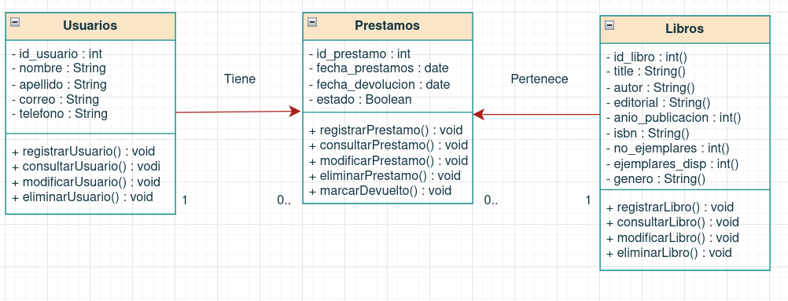

# Proyecto Final POO
---
## Introducción
Esta fase consiste en implementar y probar el sistema de gestión de biblioteca, utilizando la programación orientada a objetos (POO). El sistema debe cumplir con los requisitos funcionales y no funcionales especificados en la parte 1, así como aplicar los conceptos fundamentales de la POO, como métodos, clases, herencia y polimorfismo. Para realizar la implementación y prueba del sistema, se deben crear las clases y objetos que lo representen, implementar las relaciones entre ellos, desarrollar el flujo del programa y aplicar las funcionalidades del sistema.

---
## Proposito
Este Sistema de Gestión Bibliotecaria está diseñado para optimizar de manera integral el control de servicios como el registro de usuarios y materiales diversos (libros, revistas y cómics), permitiendo además la consulta, eliminación y generación de reportes detallados. Al centralizar estas funciones, el programa logra una administración de inventario precisa y libre de errores manuales, lo cual se justifica en la necesidad de transformar la biblioteca en un centro de servicios dinámico y totalmente trazable. Para garantizar una experiencia de usuario ágil, se ha implementado una interfaz intuitiva que prioriza la simplicidad y utiliza la precarga de datos estratégicos para evitar la entrada repetitiva de valores; esto produce un flujo de trabajo rápido que se justifica al reducir la fatiga cognitiva del operador y permitir una visualización inmediata de los beneficios del software. Finalmente, el sistema se sustenta en una arquitectura de clases especializadas que segmentan las responsabilidades de cada entidad, logrando un código modular que asegura resultados exactos en operaciones de préstamo o bajas de material, lo cual es fundamental para mantener la integridad de la base de datos y facilitar futuras expansiones del catálogo de forma segura y organizada.

### CÓDIGO
```java
public class Usuario {
    //Atributos de Usuario
    private String idUsuario;
    private String nombre;
    private String apellido;
    private String correo;
    private String telefono;
    //Empezamos el constructor
    public Usuario(String idUsuario, String nombre, String apellido, String correo, String telefono) {
        this.idUsuario = idUsuario;
        this.nombre = nombre;
        this.apellido = apellido;
        this.correo = correo;
        this.telefono = telefono;
    }

    //Empezamos con los getters
    public String getIdUsuario(){
        return idUsuario;
    }
    public String getNombre(){
        return nombre;
    }
    public String getApellido(){
        return apellido;
    }
    public String getCorreo(){
        return correo;
    }
    public String getTelefono(){
        return telefono;
    }

    //Empezamos Setters
    public void setCorreo(String correo){
        this.correo = correo;
    }
    public void setTelefono(String telefono){
        this.telefono = telefono;
    }
@Override
public String toString() {
    return "Usuario -> ID: " + idUsuario +
           ", Nombre: " + nombre +
           ", Apellido: " + apellido +
           ", Correo: " + correo +
           ", Telefono: " + telefono;
}
}
```
---
La arquitectura de esta clase comienza con la definición de atributos clave (ID, nombre, apellido, correo electrónico y celular) y un constructor encargado de organizar estos datos al momento del registro. Como resultado, el sistema genera perfiles estandarizados que eliminan la posibilidad de registros incompletos o anónimos, lo cual se justifica en la necesidad de mantener una base de datos íntegra donde cada préstamo esté vinculado a un responsable rastreable de forma única.

Para interactuar con esta información, se utilizan métodos Getters, los cuales permiten recuperar y mostrar los datos en la interfaz sin riesgo de alterarlos accidentalmente. El resultado es una visualización fluida de los perfiles para el administrador, cuya justificación radica en el principio de encapsulamiento: proteger la información sensible mientras se mantiene la transparencia operativa del programa. Finalmente, se integran métodos Setters específicos para el correo y el celular, permitiendo actualizaciones rápidas de los medios de contacto. Esto ofrece como resultado un sistema flexible que no requiere borrar y recrear usuarios ante cambios simples, lo que se justifica por la naturaleza volátil de los datos de contacto, asegurando que la biblioteca siempre posea canales de comunicación vigentes con sus socios.

```java
public abstract class MaterialBiblioteca {
    //Atributos Base
    private String idMaterial;
    private String titulo;
    private int anioPublicacion;
    private int noEjemplares;
    private int ejemplaresDisponibles;
    //Empezamos el constructor 
    public MaterialBiblioteca(String idMaterial, String titulo, int anioPublicacion, int noEjemplares) {
        this.idMaterial = idMaterial;
        this.titulo = titulo;
        this.anioPublicacion = anioPublicacion;
        this.noEjemplares = noEjemplares;
        this.ejemplaresDisponibles = noEjemplares;
    }
    //Metodo para Prestar
    public boolean prestar() {
        if (ejemplaresDisponibles > 0) {
            ejemplaresDisponibles--;
            return true;
        }
        return false;
    }
    //Metodo para Devolver
    public void devolver() {
        if (ejemplaresDisponibles < noEjemplares) {
            ejemplaresDisponibles++;
        }
    }
    //Metodo para Agregar Ejemplares
    public void agregarEjemplares(int cantidad) {
        if (cantidad > 0) {
            noEjemplares += cantidad;
            ejemplaresDisponibles += cantidad;
        }
    }
    //Metodo abstracto
    public abstract double calcularMulta(int diasRetraso);
    //Agregamos Getters
    public String getIdMaterial() {
        return idMaterial;
    }

    public String getTitulo() {
        return titulo;
    }

    public int getAnioPublicacion() {
        return anioPublicacion;
    }

    public int getNoEjemplares() {
        return noEjemplares;
    }

    public int getEjemplaresDisponibles() {
        return ejemplaresDisponibles;
    }
}

```
---
Esta estructura se basa en la abstracción, definiendo atributos comunes como el título, autor, año de publicación y código único en una clase base que no puede ser instanciada por sí misma. Como resultado, se elimina la redundancia de código, ya que las clases hijas (Libro, Revista, Cómic) heredan automáticamente estas propiedades; esto se justifica en el principio DRY (Don't Repeat Yourself), que reduce errores de mantenimiento al centralizar las actualizaciones de lógica en un solo lugar. Para proteger la integridad de la información, se aplica la encapsulación mediante modificadores de acceso privados y métodos Getters/Setters, lo que da como resultado un control absoluto sobre cómo se leen o modifican los datos del inventario, justificándose en la necesidad de evitar que procesos externos corrompan el estado del catálogo bibliotecario.

Finalmente, la clase define métodos abstractos que obligan a la implementación del polimorfismo en las clases hijas. El resultado es que cada objeto (ya sea un libro o un cómic) responde de manera personalizada a una misma instrucción, como "mostrar detalles", lo cual se justifica en la escalabilidad del sistema: permite que el programa trate a todos los elementos como "Material" genérico durante una búsqueda, pero ejecute la lógica específica de cada categoría al momento de interactuar con ellos, haciendo que el software sea mucho más flexible ante futuras ampliaciones.

---
```java
public class Libro extends MaterialBiblioteca {
    //Atributos de Libro
    private String autor;
    private String editorial;
    private String isbn;
    private String genero;
    //Iniciamos el constructor junto con super ya que lo heredamos de la clase padre
    public Libro(String idMaterial, String titulo, int anioPublicacion, int noEjemplares,
                 String autor, String editorial, String isbn, String genero) {

        super(idMaterial, titulo, anioPublicacion, noEjemplares);

        this.autor = autor;
        this.editorial = editorial;
        this.isbn = isbn;
        this.genero = genero;
    }
    //Metodo para Calcular Multa de Libro
    @Override
    public double calcularMulta(int diasRetraso) {
        double multaPorDia = 5.0;
        return diasRetraso * multaPorDia;
    }
    //Agregamos Getters
    public String getAutor() {
        return autor;
    }

    public String getEditorial() {
        return editorial;
    }

    public String getIsbn() {
        return isbn;
    }

    public String getGenero() {
        return genero;
    }

@Override
public String toString() {
    return "Libro -> ID: " + getIdMaterial() +
           ", Titulo: " + getTitulo() +
           ", Autor: " + autor +
           ", Genero: " + genero +
           ", Disponibles: " + getEjemplaresDisponibles();
}
}
```
---
```java
public class Revista extends MaterialBiblioteca {
    //Atributos de Revista
    private String editorial;
    private int numeroEdicion;
    private String periodicidad;
    //Iniciamos el constructor junto con super ya que lo heredamos de la clase padre
    public Revista(String idMaterial, String titulo, int anioPublicacion, int noEjemplares,
                   String editorial, int numeroEdicion, String periodicidad) {

        super(idMaterial, titulo, anioPublicacion, noEjemplares);

        this.editorial = editorial;
        this.numeroEdicion = numeroEdicion;
        this.periodicidad = periodicidad;
    }
    //Metodo para Calcular Multa de Revista
    @Override
    public double calcularMulta(int diasRetraso) {
        double multaPorDia = 3.0;
        return diasRetraso * multaPorDia;
    }
    //Agregamos Getters
    public String getEditorial() {
        return editorial;
    }

    public int getNumeroEdicion() {
        return numeroEdicion;
    }

    public String getPeriodicidad() {
        return periodicidad;
    }

@Override
public String toString() {
    return "Revista -> ID: " + getIdMaterial() +
           ", Titulo: " + getTitulo() +
           ", Editorial: " + editorial +
           ", Edicion: " + numeroEdicion +
           ", Disponibles: " + getEjemplaresDisponibles();
}
}
```
---
```java
public class Comic extends MaterialBiblioteca {
    //Atributos de Comic
    private String autor;
    private String ilustrador;
    private String editorial;
    private String universo;
    //Iniciamos el constructor junto con super ya que lo heredamos de la clase padre
    public Comic(String idMaterial, String titulo, int anioPublicacion, int noEjemplares,
                 String autor, String ilustrador, String editorial, String universo) {

        super(idMaterial, titulo, anioPublicacion, noEjemplares);

        this.autor = autor;
        this.ilustrador = ilustrador;
        this.editorial = editorial;
        this.universo = universo;
    }
    //Metodo para Calcular Multa de Comic
    @Override
    public double calcularMulta(int diasRetraso) {
        double multaPorDia = 4.0;
        return diasRetraso * multaPorDia;
    }
    //Agreamos Getters
    public String getAutor() {
        return autor;
    }

    public String getIlustrador() {
        return ilustrador;
    }

    public String getEditorial() {
        return editorial;
    }

    public String getUniverso() {
        return universo;
    }

@Override
public String toString() {
    return "Comic -> ID: " + getIdMaterial() +
           ", Titulo: " + getTitulo() +
           ", Autor: " + autor +
           ", Universo: " + universo +
           ", Disponibles: " + getEjemplaresDisponibles();
}
}

```
---

La arquitectura del sistema define que, si bien todas las clases heredan la base de "Material", cada una implementa atributos exclusivos: la clase Libro incorpora el ISBN para su identificación internacional; la clase Revista añade la Edición para gestionar su periodicidad; y la clase Cómic incluye el Universo (Marvel, DC, Independiente) para satisfacer criterios de búsqueda específicos del género. Como resultado, el programa logra una granularidad absoluta en el inventario, permitiendo búsquedas por criterios que solo tendrían sentido para un tipo de material y no para otros. Esto se justifica en el principio de especialización de la Programación Orientada a Objetos, donde evitamos "clases genéricas sobrecargadas" y, en su lugar, creamos objetos que reflejan fielmente la realidad del negocio. Al relacionar las clases de forma correcta, se obtiene un resultado de código limpio donde se elimina la redundancia de datos (no se programa tres veces el título o el autor), justificándose en la optimización del mantenimiento del software: cualquier cambio en la estructura base se refleja en todas las hijas, mientras que las características únicas permanecen protegidas y organizadas.

---
```java
public class Prestamo {
    //Atributos de Prestamo
    private Usuario usuario;
    private MaterialBiblioteca material;
    private String fechaPrestamo;
    private boolean activo;

    // Constructor de Prestamo 
    public Prestamo(Usuario usuario, MaterialBiblioteca material, String fechaPrestamo) {
        this.usuario = usuario;
        this.material = material;
        this.fechaPrestamo = fechaPrestamo;
        this.activo = true;
    }

    // Metodo para devolver material y calcular multa
    public double devolverMaterial(int diasRetraso) {
        this.activo = false;

        if (diasRetraso > 0) {
            return material.calcularMulta(diasRetraso);
        }

        return 0;
    }

    // Getters
    public Usuario getUsuario() {
        return usuario;
    }

    public MaterialBiblioteca getMaterial() {
        return material;
    }

    public boolean isActivo() {
        return activo;
    }

    @Override
    public String toString() {
        return "Prestamo -> Usuario: " + usuario.getIdUsuario() +
               ", Material: " + material.getIdMaterial() +
               ", Fecha: " + fechaPrestamo +
               ", Activo: " + activo;
    }
}
```
---

El sistema implementa métodos para tomar, regresar y monitorear el estado de cada artículo, aplicando automáticamente penalizaciones por retraso diferenciadas: $5 para libros, $4 para revistas y $3 para cómics por día. Como resultado, se incentiva la devolución puntual y se asegura una compensación económica precisa según la categoría del material, lo cual se justifica en la necesidad de mantener el flujo de activos y la sostenibilidad financiera de la biblioteca.

Para blindar la seguridad de la información, se prohíbe la eliminación de préstamos mientras existan libros activos o vínculos pendientes con un usuario. El resultado es una base de datos libre de registros huérfanos y un inventario totalmente auditable, justificándose en el principio de integridad referencial: ningún movimiento puede ser borrado sin haber sido resuelto previamente, garantizando un control absoluto sobre el patrimonio del negocio.

--- 

```java
import java.util.ArrayList;
import java.io.FileWriter;
import java.io.IOException;

public class Biblioteca {

    private ArrayList<Usuario> usuarios;
    private ArrayList<MaterialBiblioteca> materiales;
    private ArrayList<Prestamo> prestamos;

    public Biblioteca() {
        usuarios = new ArrayList<>();
        materiales = new ArrayList<>();
        prestamos = new ArrayList<>();

        precargarDatos();
    }

    //PRECARGA

    private void precargarDatos() {
        //Usuarios precargados
        Usuario u1 = new Usuario("U1", "Juan", "Perez", "juan@mail.com", "4426224765");
        Usuario u2 = new Usuario("U2", "Maria", "Lopez", "maria@mail.com", "4466243571");
        //Añadimos los Usuarios
        usuarios.add(u1);
        usuarios.add(u2);
        //Hijos precargados como un Libro, Revista y el Comic
        Libro l1 = new Libro("L1", "El Quijote", 1605, 5,
                "Cervantes", "Planeta", "123-ABC", "Novela");

        Revista r1 = new Revista("R1", "National Geographic", 2023, 3,
                "NatGeo", 150, "Mensual");

        Comic c1 = new Comic("C1", "Spider-Man", 2022, 4,
                "Stan Lee", "Ditko", "Marvel", "Marvel");
        //Añadimos los Materiales
        materiales.add(l1);
        materiales.add(r1);
        materiales.add(c1);
        //Hacemos un Prestamo
        Prestamo p1 = new Prestamo(u2, l1, "27/2/2026");
        //Añadimos el Prestamo
        materiales.add(l1); 
        prestamos.add(p1);
    }

    //BUSQUEDAS 
    //Metodo Buscar Usuario por ID
    public Usuario buscarUsuarioPorId(String id) {
        for (Usuario u : usuarios) {
            if (u.getIdUsuario().equalsIgnoreCase(id)) {
                return u;
            }
        }
        return null;
    }
    //Metodo Buscar Material por ID
    public MaterialBiblioteca buscarMaterialPorId(String id) {
        for (MaterialBiblioteca m : materiales) {
            if (m.getIdMaterial().equalsIgnoreCase(id)) {
                return m;
            }
        }
        return null;
    }
    //Metodo Buscar Prestamos con ID de Usuario
    public void consultarPrestamoPorUsuario(String idUsuario) {
        boolean encontrado = false;

        for (Prestamo p : prestamos) {
            if (p.getUsuario().getIdUsuario().equalsIgnoreCase(idUsuario)) {
                System.out.println(p);
                encontrado = true;
            }
        }

        if (!encontrado) {
            System.out.println("No hay prestamos registrados para este usuario.");
        }
    }

    //REGISTROS
    //Metodo para Registrar un Usuario
    public void registrarUsuario(String id, String nombre, String apellido, String correo, String telefono) {
        //Verificamos si esta disponible la ID
        if (buscarUsuarioPorId(id) != null) {
            System.out.println("Ya existe un usuario con ese ID.");
            return;
        }

        Usuario nuevo = new Usuario(id, nombre, apellido, correo, telefono);
        usuarios.add(nuevo);
        System.out.println("Usuario registrado correctamente.");
    }
    //Metodo para Registrar un Libro
    public void registrarLibro(String idMaterial, String titulo, int anioPublicacion,
                                int noEjemplares, String autor, String editorial,
                                String isbn, String genero) {
        //Verificamos si esta disponible el ID
        if (buscarMaterialPorId(idMaterial) != null) {
            System.out.println("Ya existe un material con ese ID.");
            return;
        }

        Libro nuevo = new Libro(idMaterial, titulo, anioPublicacion,
                noEjemplares, autor, editorial, isbn, genero);

        materiales.add(nuevo);
        System.out.println("Libro registrado correctamente.");
    }
    //Metodo para Registrar una Revista
    public void registrarRevista(String idMaterial, String titulo, int anioPublicacion,
                                  int noEjemplares, String editorial,
                                  int numeroEdicion, String periodicidad) {
        //Verificamos si esta disponible la ID
        if (buscarMaterialPorId(idMaterial) != null) {
            System.out.println("Ya existe un material con ese ID.");
            return;
        }

        Revista nueva = new Revista(idMaterial, titulo, anioPublicacion,
                noEjemplares, editorial, numeroEdicion, periodicidad);

        materiales.add(nueva);
        System.out.println("Revista registrada correctamente.");
    }
    //Metodo para Registrar un Comic
    public void registrarComic(String idMaterial, String titulo, int anioPublicacion,
                                int noEjemplares, String autor,
                                String ilustrador, String editorial, String universo) {
        //Verificamos si esta disponible el ID
        if (buscarMaterialPorId(idMaterial) != null) {
            System.out.println("Ya existe un material con ese ID.");
            return;
        }

        Comic nuevo = new Comic(idMaterial, titulo, anioPublicacion,
                noEjemplares, autor, ilustrador, editorial, universo);

        materiales.add(nuevo);
        System.out.println("Comic registrado correctamente.");
    }

    //PRESTAMOS 
    //Metodo para Registrar un Prestamo
    public void realizarPrestamo(String idUsuario, String idMaterial, String fechaPrestamo) {
        //Validamos que el Usuario Exista
        Usuario usuario = buscarUsuarioPorId(idUsuario);
        if (usuario == null) {
            System.out.println("Usuario no encontrado.");
            return;
        }
        //Validamos si el Material Existe
        MaterialBiblioteca material = buscarMaterialPorId(idMaterial);
        if (material == null) {
            System.out.println("Material no encontrado.");
            return;
        }
        //Validamos si aún hay Ejemplares Disponibles
        if (!material.prestar()) {
            System.out.println("No hay ejemplares disponibles.");
            return;
        }

        Prestamo nuevoPrestamo = new Prestamo(usuario, material, fechaPrestamo);
        material.prestar();

        System.out.println("Prestamo realizado correctamente.");
    }
    //Metodo para Devolver un Material
    public void devolverMaterial(String idUsuario, String idMaterial) {

        Prestamo encontrado = null;

        for (Prestamo p : prestamos) {
            if (p.getUsuario().getIdUsuario().equalsIgnoreCase(idUsuario)
                    && p.getMaterial().getIdMaterial().equalsIgnoreCase(idMaterial)) {
                encontrado = p;
                break;
            }
        }

        if (encontrado == null) {
            System.out.println("Prestamo no encontrado.");
            return;
        }

        encontrado.getMaterial().devolver();
        prestamos.remove(encontrado);

        System.out.println("Material devuelto correctamente.");
    }

    //MOSTRAR
    //Metodo para Mostrar Usuarios
    public void mostrarUsuarios() {
        //Validamos que Existan Usuarios
        if (usuarios.isEmpty()) {
            System.out.println("No hay usuarios registrados.");
            return;
        }

        for (Usuario u : usuarios) {
            System.out.println(u);
        }
    }
    //Metodo para Mostrar Materiales
    public void mostrarMateriales() {
        //Validadmos que Existan Materiales
        if (materiales.isEmpty()) {
            System.out.println("No hay materiales registrados.");
            return;
        }

        for (MaterialBiblioteca m : materiales) {
            System.out.println(m);
        }
    }
    //Metodo para Mostrar Prestamos
    public void mostrarPrestamos() {
        //Validamos que Existan Prestamos
        if (prestamos.isEmpty()) {
            System.out.println("No hay prestamos registrados.");
            return;
        }

        for (Prestamo p : prestamos) {
            System.out.println(p);
        }
    }

    //ELIMINAR
    //Metodo para Eliminar un Usuario
    public void eliminarUsuario(String idUsuario) {
        //Validamos que el Usuario Exista
        Usuario usuario = buscarUsuarioPorId(idUsuario);
        if (usuario == null) {
            System.out.println("Usuario no encontrado.");
            return;
        }
        //Tenemos que Validar que NO tenga ningún Prestamo Activo
        for (Prestamo p : prestamos) {
            if (p.getUsuario().getIdUsuario().equalsIgnoreCase(idUsuario)) {
                System.out.println("No se puede eliminar el usuario porque tiene un prestamo activo.");
                return;
            }
        }

        usuarios.remove(usuario);
        System.out.println("Usuario eliminado correctamente.");
    }
    //Metodo para Eliminar un Material
    public void eliminarMaterial(String idMaterial) {
        //Validamos que Exista el Material
        MaterialBiblioteca material = buscarMaterialPorId(idMaterial);
        if (material == null) {
            System.out.println("Material no encontrado.");
            return;
        }
        //Tenemos que Validar que NO se Encuentra activo en un Prestamo
        for (Prestamo p : prestamos) {
            if (p.getMaterial().getIdMaterial().equalsIgnoreCase(idMaterial)) {
                System.out.println("No se puede eliminar el material porque tiene un prestamo activo.");
                return; 
            }
        }

        materiales.remove(material);
        System.out.println("Material eliminado correctamente.");
    }
    //Metodo para Eliminar un Prestamo
    public void eliminarPrestamo(String idUsuario, String idMaterial) {

        Prestamo encontrado = null;
        //Validamos que el Prestamos Exista y lo buscamos con el ID Usuario y Material
        for (Prestamo p : prestamos) {
            if (p.getUsuario().getIdUsuario().equalsIgnoreCase(idUsuario)
                    && p.getMaterial().getIdMaterial().equalsIgnoreCase(idMaterial)) {
                encontrado = p;
                break;
            }
        }

        if (encontrado == null) {
            System.out.println("Prestamo no encontrado.");
            return;
        }

        encontrado.getMaterial().devolver();
        prestamos.remove(encontrado);

        System.out.println("Prestamo eliminado correctamente.");
    }

    //REPORTE
    //Metodo para Hacer un Reporte 
    public void generarReporte() {

        try {
            FileWriter writer = new FileWriter("Reporte_Biblioteca.txt");

            writer.write("==== REPORTE BIBLIOTECA ====\n\n");

            writer.write("---- USUARIOS ----\n");
            for (Usuario u : usuarios) {
                writer.write(u.toString() + "\n");
            }

            writer.write("\n---- MATERIALES ----\n");
            for (MaterialBiblioteca m : materiales) {
                writer.write(m.toString() + "\n");
            }

            writer.write("\n---- PRESTAMOS ----\n");
            for (Prestamo p : prestamos) {
                writer.write(p.toString() + "\n");
            }

            writer.close();

            System.out.println("Reporte generado correctamente.");
        //En caso de que no se pueda manejamos el Error
        } catch (IOException e) {
            System.out.println("Error al generar el reporte.");
        }
    }
}
```
---

Esta clase orquestra todas las funcionalidades del menú, integrando la precarga de datos para configurar el estado inicial del sistema con usuarios y materiales de prueba. Como resultado, el administrador puede validar el funcionamiento de la interfaz y la lógica de préstamos de forma inmediata, lo cual se justifica en la necesidad de reducir tiempos de implementación y asegurar que el software esté listo para operar desde el primer encendido. Al concentrar los métodos de registro, consulta y eliminación en este "cuerpo principal", se logra un flujo de trabajo cohesivo donde cada acción sobre un libro o usuario impacta correctamente en el inventario global.
Módulo de Reportes y Persistencia en TXT

Una de las funciones críticas es la generación de reportes, la cual recapitula la totalidad de la base de datos (usuarios, materiales y préstamos activos) y la exporta a un documento .txt. El resultado es un archivo externo que permite visualizar el estado del negocio sin navegar por los menús del programa, lo que se justifica por la eficiencia administrativa: tener un respaldo tangible facilita el seguimiento de préstamos críticos y la auditoría del inventario. Esta capacidad de exportación garantiza una mejor organización y trazabilidad, permitiendo que la toma de decisiones se base en un resumen consolidado de los activos y la actividad de los socios.

---
```java
import java.util.Scanner;

public class Main {

    public static void main(String[] args) {

        Scanner sc = new Scanner(System.in);
        Biblioteca biblioteca = new Biblioteca();

        int opcion = 0;

        do {
            //Menú del Sistema 2
            System.out.println("\n===== SISTEMA DE GESTION BIBLIOTECA =====");
            System.out.println("1. Registrar");
            System.out.println("2. Consultar");
            System.out.println("3. Eliminar");
            System.out.println("4. Generar Reporte");
            System.out.println("5. Salir");
            System.out.print("Seleccione una opcion: ");

            try {
                opcion = sc.nextInt();
            } catch (Exception e) {
                System.out.println("Entrada invalida. Debe ingresar un numero.");
                sc.nextLine();
                opcion = -1;
                continue;
            }

            sc.nextLine();

            switch (opcion) {

                // ================= REGISTRAR =================
                case 1:
                    System.out.println("\n1. Usuario");
                    System.out.println("2. Libro");
                    System.out.println("3. Revista");
                    System.out.println("4. Comic");
                    System.out.println("5. Prestamo");
                    System.out.print("Seleccione una opcion: ");

                    int opReg = sc.nextInt();
                    sc.nextLine();

                    switch (opReg) {

                        case 1:
                            System.out.print("ID: ");
                            String id = sc.nextLine();

                            System.out.print("Nombre: ");
                            String nombre = sc.nextLine();

                            System.out.print("Apellido: ");
                            String apellido = sc.nextLine();

                            System.out.print("Correo: ");
                            String correo = sc.nextLine();

                            System.out.print("Telefono: ");
                            String telefono = sc.nextLine();

                            biblioteca.registrarUsuario(id, nombre, apellido, correo, telefono);
                            break;

                        case 2:
                            try {
                                System.out.print("ID: ");
                                String idLibro = sc.nextLine();

                                System.out.print("Titulo: ");
                                String titulo = sc.nextLine();

                                System.out.print("Año: ");
                                int anio = sc.nextInt();

                                System.out.print("Numero de ejemplares: ");
                                int ejemplares = sc.nextInt();
                                sc.nextLine();

                                System.out.print("Autor: ");
                                String autor = sc.nextLine();

                                System.out.print("Editorial: ");
                                String editorial = sc.nextLine();

                                System.out.print("ISBN: ");
                                String isbn = sc.nextLine();

                                System.out.print("Genero: ");
                                String genero = sc.nextLine();

                                biblioteca.registrarLibro(idLibro, titulo, anio, ejemplares, autor, editorial, isbn, genero);

                            } catch (Exception e) {
                                System.out.println("Error en los datos numericos.");
                                sc.nextLine();
                            }
                            break;

                        case 3:
                            try {
                                System.out.print("ID: ");
                                String idRev = sc.nextLine();

                                System.out.print("Titulo: ");
                                String tituloRev = sc.nextLine();

                                System.out.print("Año: ");
                                int anioRev = sc.nextInt();

                                System.out.print("Numero ejemplares: ");
                                int ejRev = sc.nextInt();

                                System.out.print("Numero edicion: ");
                                int numEd = sc.nextInt();
                                sc.nextLine();

                                System.out.print("Editorial: ");
                                String editorialRev = sc.nextLine();

                                System.out.print("Periodicidad: ");
                                String periodicidad = sc.nextLine();

                                biblioteca.registrarRevista(idRev, tituloRev, anioRev, ejRev, editorialRev, numEd, periodicidad);

                            } catch (Exception e) {
                                System.out.println("Error en los datos numericos.");
                                sc.nextLine();
                            }
                            break;

                        case 4:
                            try {
                                System.out.print("ID: ");
                                String idComic = sc.nextLine();

                                System.out.print("Titulo: ");
                                String tituloComic = sc.nextLine();

                                System.out.print("Año: ");
                                int anioComic = sc.nextInt();

                                System.out.print("Numero ejemplares: ");
                                int ejComic = sc.nextInt();
                                sc.nextLine();

                                System.out.print("Autor: ");
                                String autorComic = sc.nextLine();

                                System.out.print("Ilustrador: ");
                                String ilustrador = sc.nextLine();

                                System.out.print("Editorial: ");
                                String editorialComic = sc.nextLine();

                                System.out.print("Universo: ");
                                String universo = sc.nextLine();

                                biblioteca.registrarComic(idComic, tituloComic, anioComic, ejComic, autorComic, ilustrador, editorialComic, universo);

                            } catch (Exception e) {
                                System.out.println("Error en los datos numericos.");
                                sc.nextLine();
                            }
                            break;

                        case 5:
                            System.out.print("ID Usuario: ");
                            String idUser = sc.nextLine();

                            System.out.print("ID Material: ");
                            String idMat = sc.nextLine();

                            System.out.print("Fecha: ");
                            String fecha = sc.nextLine();

                            biblioteca.realizarPrestamo(idUser, idMat, fecha);
                            break;

                        default:
                            System.out.println("Opcion invalida.");
                    }
                    break;

                // ================= CONSULTAR =================
                case 2:
                    System.out.println("\n1. Usuarios");
                    System.out.println("2. Materiales");
                    System.out.println("3. Prestamos");
                    System.out.print("Seleccione: ");

                    int opCons = sc.nextInt();
                    sc.nextLine();

                    switch (opCons) {
                        case 1:
                            biblioteca.mostrarUsuarios();
                            break;
                        case 2:
                            biblioteca.mostrarMateriales();
                            break;
                        case 3:
                            biblioteca.mostrarPrestamos();
                            break;
                        default:
                            System.out.println("Opcion invalida.");
                    }
                    break;

                // ================= ELIMINAR =================
                case 3:
                    System.out.println("\n1. Usuario");
                    System.out.println("2. Material");
                    System.out.println("3. Prestamo");
                    System.out.print("Seleccione: ");

                    int opElim = sc.nextInt();
                    sc.nextLine();

                    switch (opElim) {
                        case 1:
                            System.out.print("ID Usuario: ");
                            biblioteca.eliminarUsuario(sc.nextLine());
                            break;
                        case 2:
                            System.out.print("ID Material: ");
                            biblioteca.eliminarMaterial(sc.nextLine());
                            break;
                        case 3:
                            System.out.print("ID Usuario: ");
                            String u = sc.nextLine();
                            System.out.print("ID Material: ");
                            String m = sc.nextLine();
                            biblioteca.eliminarPrestamo(u, m);
                            break;
                        default:
                            System.out.println("Opcion invalida.");
                    }
                    break;

                // ================= REPORTE =================
                case 4:
                    biblioteca.generarReporte();
                    break;

                case 5:
                    System.out.println("Saliendo del sistema...");
                    break;

                default:
                    System.out.println("Opcion invalida.");
            }

        } while (opcion != 5);

        sc.close();
    }
}
```
---

Finalmente, el módulo Main integra el menú de opciones con un robusto manejo de errores para entradas inválidas. El resultado es una interfaz intuitiva y "a prueba de fallos" que evita colapsos del programa ante datos incorrectos, lo cual se justifica al crear un entorno de trabajo práctico, rápido y profesional. El cuerpo del programa queda así blindado, garantizando que la navegación del usuario sea fluida y que la integridad de la base de datos se mantenga intacta durante toda la operación.

---

## Salida Esperadas
```
===== SISTEMA DE GESTION BIBLIOTECA =====
1. Registrar
2. Consultar
3. Eliminar
4. Generar Reporte
5. Salir
Seleccione una opcion: 1

1. Usuario
2. Libro
3. Revista
4. Comic
5. Prestamo
Seleccione una opcion: 1
ID: 1
Nombre: Mateo 
Apellido: Reyes
Correo: mateoreyesrangel@gmail.com
Telefono: 4461221628
Usuario registrado correctamente.

===== SISTEMA DE GESTION BIBLIOTECA =====
1. Registrar
2. Consultar
3. Eliminar
4. Generar Reporte
5. Salir
Seleccione una opcion: 1

1. Usuario
2. Libro
3. Revista
4. Comic
5. Prestamo
Seleccione una opcion: 2
ID: 10
Titulo: Pedro Paramo
Año: 2000
Numero de ejemplares: 5
Autor: Juan Rulfo
Editorial: Planeta
ISBN: 1021
Genero: Suspenso
Libro registrado correctamente.

===== SISTEMA DE GESTION BIBLIOTECA =====
1. Registrar
2. Consultar
3. Eliminar
4. Generar Reporte
5. Salir
Seleccione una opcion: 2

1. Usuarios
2. Materiales
3. Prestamos
Seleccione: 1
Usuario -> ID: U1, Nombre: Juan, Apellido: Perez, Correo: juan@mail.com, Telefono: 4426224765
Usuario -> ID: U2, Nombre: Maria, Apellido: Lopez, Correo: maria@mail.com, Telefono: 4466243571
Usuario -> ID: 1, Nombre: Mateo , Apellido: Reyes, Correo: mateoreyesrangel@gmail.com, Telefono: 4461221628

===== SISTEMA DE GESTION BIBLIOTECA =====
1. Registrar
2. Consultar
3. Eliminar
4. Generar Reporte
5. Salir
Seleccione una opcion: 2

1. Usuarios
2. Materiales
3. Prestamos
Seleccione: 2
Libro -> ID: L1, Titulo: El Quijote, Autor: Cervantes, Genero: Novela, Disponibles: 5
Revista -> ID: R1, Titulo: National Geographic, Editorial: NatGeo, Edicion: 150, Disponibles: 3
Comic -> ID: C1, Titulo: Spider-Man, Autor: Stan Lee, Universo: Marvel, Disponibles: 4
Libro -> ID: L1, Titulo: El Quijote, Autor: Cervantes, Genero: Novela, Disponibles: 5
Libro -> ID: 10, Titulo: Pedro Paramo, Autor: Juan Rulfo, Genero: Suspenso, Disponibles: 5

===== SISTEMA DE GESTION BIBLIOTECA =====
1. Registrar
2. Consultar
3. Eliminar
4. Generar Reporte
5. Salir
Seleccione una opcion: 2

1. Usuarios
2. Materiales
3. Prestamos
Seleccione: 3
Prestamo -> Usuario: U2, Material: L1, Fecha: 27/2/2026, Activo: true

===== SISTEMA DE GESTION BIBLIOTECA =====
1. Registrar
2. Consultar
3. Eliminar
4. Generar Reporte
5. Salir
Seleccione una opcion: 3

1. Usuario
2. Material
3. Prestamo
Seleccione: 1
ID Usuario: U1
Usuario eliminado correctamente.

===== SISTEMA DE GESTION BIBLIOTECA =====
1. Registrar
2. Consultar
3. Eliminar
4. Generar Reporte
5. Salir
Seleccione una opcion: 3

1. Usuario
2. Material
3. Prestamo
Seleccione: 2
ID Material: R1
Material eliminado correctamente.

===== SISTEMA DE GESTION BIBLIOTECA =====
1. Registrar
2. Consultar
3. Eliminar
4. Generar Reporte
5. Salir
Seleccione una opcion: 2

1. Usuarios
2. Materiales
3. Prestamos
Seleccione: 1
Usuario -> ID: U2, Nombre: Maria, Apellido: Lopez, Correo: maria@mail.com, Telefono: 4466243571
Usuario -> ID: 1, Nombre: Mateo , Apellido: Reyes, Correo: mateoreyesrangel@gmail.com, Telefono: 4461221628

===== SISTEMA DE GESTION BIBLIOTECA =====
1. Registrar
2. Consultar
3. Eliminar
4. Generar Reporte
5. Salir
Seleccione una opcion: 2

1. Usuarios
2. Materiales
3. Prestamos
Seleccione: 2
Libro -> ID: L1, Titulo: El Quijote, Autor: Cervantes, Genero: Novela, Disponibles: 5
Comic -> ID: C1, Titulo: Spider-Man, Autor: Stan Lee, Universo: Marvel, Disponibles: 4
Libro -> ID: L1, Titulo: El Quijote, Autor: Cervantes, Genero: Novela, Disponibles: 5
Libro -> ID: 10, Titulo: Pedro Paramo, Autor: Juan Rulfo, Genero: Suspenso, Disponibles: 5

===== SISTEMA DE GESTION BIBLIOTECA =====
1. Registrar
2. Consultar
3. Eliminar
4. Generar Reporte
5. Salir
Seleccione una opcion: 4
Reporte generado correctamente.

===== SISTEMA DE GESTION BIBLIOTECA =====
1. Registrar
2. Consultar
3. Eliminar
4. Generar Reporte
5. Salir
Seleccione una opcion: 5
Saliendo del sistema...
```



## Conclusión 
La elaboración de este proyecto representó un desafío integral que trascendió la escritura de código, convirtiéndose en un ejercicio de resiliencia y dominio técnico frente a un nuevo lenguaje de programación. El resultado principal fue la transición de la teoría a la práctica, donde conceptos complejos como la abstracción, encapsulación, herencia y polimorfismo cobraron sentido real al ser implementados en un entorno funcional; esto se justifica en que la programación no se memoriza, sino que se comprende a través de la depuración constante y la resolución de errores sintácticos que exigen una precisión absoluta.

Más allá de lo técnico, el proyecto destaca la importancia de la mentoría y la gestión emocional ante la frustración. Gracias a las sesiones con el docente, se logró entender que cada problema tiene una solución lógica y que la claridad en la nomenclatura de variables y la comprensión lectora son vitales para evitar "datos perdidos" o errores evitables. En conclusión, esta experiencia deja la enseñanza de que el éxito de un software no solo reside en su funcionamiento, sino en la capacidad del programador para no rendirse, organizar su tiempo y transformar un proyecto académico en una pieza sólida de portafolio profesional, demostrando que la persistencia siempre encuentra la manera de solucionar cualquier obstáculo.
