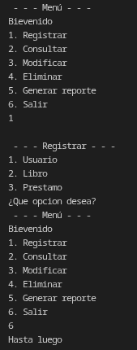

# Avance de proyecto 
---
## Introducción

En este documento se presenta a continuacion el avance del proyecto, el cual es un sistema de gestión de una bibloteca cuyo objetivo es diseñar y desarrollar una aplicación que no facilite la administración de libros, usuarios asi como los prestamos que se lleguen a solicitar.

## Justificación

Estaremos utilizando tres clases (*por el momento*): **Libros**, **Usuarios** y **Préstamos**.  
Cada clase cuenta con sus propios atributos y métodos.

La implementación se plantea de la siguiente manera: la clase **Préstamos** será la encargada de conectar a las demás, ya que un **usuario** puede tener varios préstamos activos al mismo tiempo, pero cada **préstamo** pertenece únicamente a un solo usuario. De igual forma, un **libro** puede aparecer en distintos préstamos a lo largo del tiempo, aunque cada préstamo corresponde a un solo libro.


En cuanto a la parte del código, la idea es mantener una implementación sencilla. Para evitar el uso de variables innecesarias que puedan complicar la lógica, se contará con un menú principal en el que se mostrarán **seis opciones**; sin embargo, por el momento nos enfocaremos únicamente en **tres**, ya que estas definen el rumbo inicial del proyecto: **Registrar**, **Consultar** y **Eliminar**.

Cuando el usuario seleccione alguna de estas opciones, será dirigido a un segundo menú, donde se le pedirá especificar qué desea **registrar, consultar o eliminar**. Las únicas entidades disponibles serán las tres clases definidas: **Usuarios**, **Libros** y **Préstamos**. De esta forma se simplifica la navegación, se mantiene un orden claro y se evita agregar opciones innecesarias que compliquen la estructura del menú.

Por ahora, este es el planteamiento general del diseño. Tanto la estructura como las implementaciones pueden modificarse conforme el proyecto evolucione. No obstante, si es posible mantener el programa menos robusto y más claro, este enfoque será tomado en cuenta.

## Código
```java
import java.security.cert.TrustAnchor;
import java.util.Scanner;

public class proyecto_poo {
    public static void main (String[] args){
        Scanner sc = new Scanner(System.in);
        while (true) {
            System.out.println(" - - - Menú - - - ");
            System.out.println("Bievenido" + "\n" + "1. Registrar" + "\n" + "2. Consultar" + "\n" + "3. Modificar" + "\n" + "4. Eliminar" + "\n" + "5. Generar reporte" + "\n" + "6. Salir");
            int opcion = sc.nextInt();
            switch (opcion) {
                case 1:
                    System.out.println("\n"+ " - - - Registrar - - - ");
                    System.out.println("1. Usuario" + "\n" + "2. Libro" + "\n" + "3. Prestamo" + "\n" + "¿Que opcion desea?");
                    break;
                
                case 2:
                    System.out.println(" - - - Consultar - - - ");
                    System.out.println("1. Usuario" + "\n" + "2. Libro" + "\n" + "3. Prestamo" + "\n" + "¿Que opcion desea?");
                    break;
                
                case 6:
                    System.out.println("Hasta luego");
                    break;
                    
                default:
                    break;
            }
        }
    }
}
```
## Diagrama UML


## Salida esperada


---